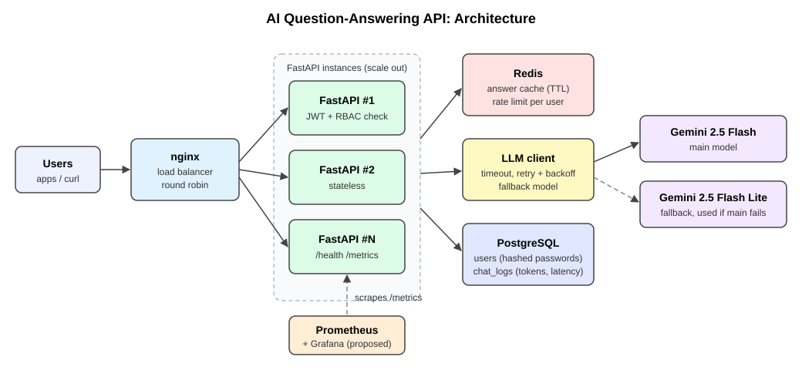
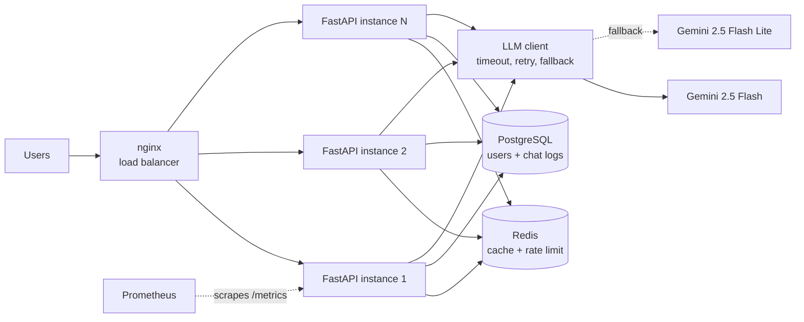

# AI Question-Answering API

A small, production-style API that answers questions using an LLM (Google Gemini).

It has JWT login, role-based access, Redis caching and rate limiting, PostgreSQL logging,
retries with a fallback model, Prometheus metrics, tests, and runs with Docker Compose
behind an nginx load balancer.

| Endpoint | What it does | Who can use it |
|---|---|---|
| `POST /auth/login` | Check username + password, return a JWT token | everyone |
| `POST /chat` | Send a question, get the LLM answer | `admin`, `user` |
| `GET /health` | Is the app, database and Redis OK? | everyone (used by load balancer) |
| `GET /metrics` | Prometheus metrics (requests, latency, tokens, errors) | `admin` |
| `GET /reports/usage` | Requests, tokens and latency per user (from PostgreSQL) | `admin`, `readonly` |

## Architecture





What happens on `POST /chat`:

1. **Auth**: the JWT in the `Authorization` header is checked, and the role must have the `chat` permission (else `401` / `403`).
2. **Rate limit**: Redis counts this user's requests in the current minute (else `429`).
3. **Cache**: if the same question was answered before, the answer comes from Redis (no LLM cost).
4. **LLM call**: Gemini is called with a timeout. A failed call is retried with backoff (1s, 2s...). If the main model keeps failing, the fallback model is tried. If everything fails: `503`.
5. **Record**: latency and token usage go to Prometheus metrics and a row in PostgreSQL `chat_logs`.

More detail: [docs/ARCHITECTURE.md](docs/ARCHITECTURE.md) (design, auth/SSO/RBAC, scaling to 500 RPS) and
[docs/MIGRATION.md](docs/MIGRATION.md) (moving from one EC2 server to 10,000 users).

## Project structure

```
ai-qa-api/
├── app/
│   ├── main.py        # FastAPI app and all endpoints
│   ├── config.py      # reads settings from environment variables
│   ├── auth.py        # password hashing, JWT, roles (RBAC)
│   ├── llm.py         # Gemini call with timeout, retry, fallback
│   ├── cache.py       # Redis cache + rate limiting
│   ├── database.py    # PostgreSQL tables (SQLAlchemy)
│   └── metrics.py     # Prometheus counters and histograms
├── tests/             # pytest tests (no Docker or API key needed)
├── nginx/nginx.conf   # load balancer config
├── docs/              # architecture, migration, learning guide, interview prep, video script
├── Dockerfile
├── docker-compose.yml
├── requirements.txt
└── .env.example       # copy to .env; real secrets never go in git
```

## Setup

### Option 1: Docker Compose (recommended)

You need [Docker Desktop](https://www.docker.com/products/docker-desktop/).

```bash
git clone <this repo>
cd ai-qa-api
cp .env.example .env          # then edit .env (at least JWT_SECRET)
docker compose up --build
```

Open http://localhost:8000/docs for the interactive API page.

Run 3 copies of the API behind the load balancer:

```bash
docker compose up --build --scale api=3
```

### Option 2: Run locally without Docker

```bash
python -m venv venv
source venv/bin/activate      # Windows: venv\Scripts\activate
pip install -r requirements-dev.txt
cp .env.example .env          # set DATABASE_URL=sqlite:///./local.db if you have no Postgres
uvicorn app.main:app --reload
```

Redis is optional locally: without it the app still works, just without cache and rate limiting.

### Using a real LLM

The default `LLM_PROVIDER=mock` returns fake answers so everything works without a key.
For real answers, get a free key at https://aistudio.google.com/apikey and set in `.env`:

```
LLM_PROVIDER=gemini
GEMINI_API_KEY=your-key-here
```

## Try it

```bash
# 1. Login (demo users: admin / alice / viewer, passwords from .env)
curl -X POST http://localhost:8000/auth/login \
  -H "Content-Type: application/json" \
  -d '{"username": "alice", "password": "alice123"}'

# 2. Ask a question (paste the access_token from step 1)
curl -X POST http://localhost:8000/chat \
  -H "Authorization: Bearer <token>" \
  -H "Content-Type: application/json" \
  -d '{"question": "What is Docker?"}'
```

Example answer:

```json
{
  "answer": "Docker is a tool that packages an application ...",
  "model": "gemini-2.5-flash",
  "cached": false,
  "prompt_tokens": 5,
  "answer_tokens": 182,
  "latency_ms": 2140
}
```

Ask the same question again and you get `"cached": true` with a much smaller latency.

```bash
curl http://localhost:8000/health
curl http://localhost:8000/metrics -H "Authorization: Bearer <admin token>"
curl http://localhost:8000/reports/usage -H "Authorization: Bearer <admin or viewer token>"
```

## Error codes

| Code | When |
|---|---|
| 401 | Wrong password, missing / invalid / expired token |
| 403 | Your role is not allowed (e.g. `readonly` calling `/chat`) |
| 422 | Bad request body (e.g. empty question, question over 2000 characters) |
| 429 | More than `RATE_LIMIT_PER_MINUTE` chat requests in one minute |
| 503 | LLM failed after all retries and the fallback model; or database down on `/health` |

## Tests

```bash
pip install -r requirements-dev.txt
pytest -v
```

17 tests cover login, invalid tokens, role checks, chat, caching, rate limiting, retry,
fallback model, the 503 when the LLM is down, and database logging. Tests use SQLite,
an in-memory fake Redis and the mock LLM, so they need no Docker and no API key.
GitHub Actions (`.github/workflows/tests.yml`) runs them and builds the Docker image on every push.

## Configuration

All settings are environment variables (see [.env.example](.env.example)). Nothing secret is in the code.

| Variable | Default | Meaning |
|---|---|---|
| `JWT_SECRET` | (required) | Key used to sign tokens |
| `JWT_EXPIRE_MINUTES` | 60 | Token lifetime |
| `DATABASE_URL` | `sqlite:///./local.db` | Set to PostgreSQL by docker-compose |
| `REDIS_URL` | `redis://localhost:6379/0` | Redis address |
| `LLM_PROVIDER` | `mock` | `gemini` or `mock` |
| `GEMINI_API_KEY` | empty | Your Gemini key |
| `LLM_MODEL` / `LLM_FALLBACK_MODEL` | `gemini-2.5-flash` / `gemini-2.5-flash-lite` | Main and backup model |
| `LLM_TIMEOUT_SECONDS` | 20 | Stop waiting for the LLM after this |
| `LLM_MAX_RETRIES` | 2 | Tries per model |
| `CACHE_TTL_SECONDS` | 3600 | How long a cached answer lives |
| `RATE_LIMIT_PER_MINUTE` | 10 | Chat requests per user per minute |
| `ADMIN_PASSWORD`, `USER_PASSWORD`, `READONLY_PASSWORD` | empty | Demo users are created only if set |

## Documentation

| File | For |
|---|---|
| [docs/ARCHITECTURE.md](docs/ARCHITECTURE.md) | Design decisions, SSO/OIDC + RBAC, scaling to 100–500 RPS |
| [docs/MIGRATION.md](docs/MIGRATION.md) | Single EC2 → 10,000 users production architecture and migration plan |
| [docs/LEARNING_GUIDE.md](docs/LEARNING_GUIDE.md) | Step by step: every tool and term used here, and how each file works |
| [docs/INTERVIEW_PREP.md](docs/INTERVIEW_PREP.md) | How to explain the project, and common questions with answers |
| [docs/VIDEO_SCRIPT.md](docs/VIDEO_SCRIPT.md) | A 5 minute walkthrough script |

## What I would add next

- Kubernetes manifests + HPA (described in the architecture doc)
- A real background queue (Celery or RQ) for long questions
- Streaming answers, RAG with a vector database
- Alembic for database migrations, refresh tokens, user management endpoints for admins
