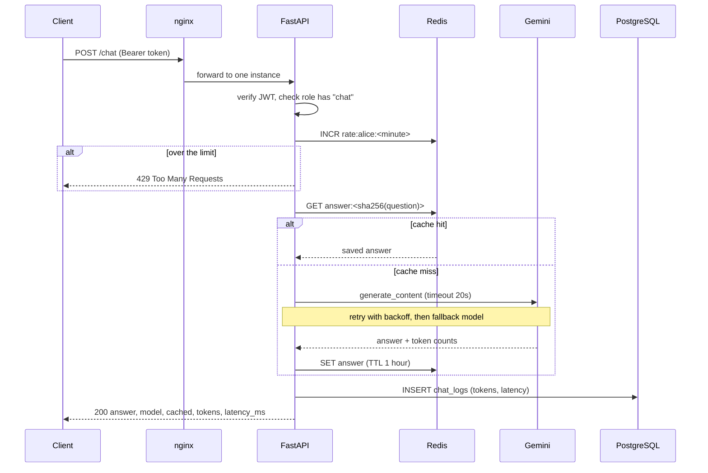
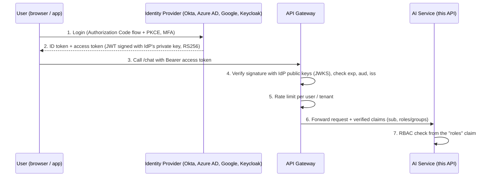

# Architecture and Design Decisions

This document covers: how the system is built and why, authentication (JWT now, SSO/OIDC later),
RBAC, deployment, and how it would handle 100 to 500 requests per second.


## 1. The request flow



## 2. Components and why I chose them

| Component | Why | Trade-off / alternative |
|---|---|---|
| **FastAPI** | Fast to write, validates requests with Pydantic, auto docs at `/docs`, supports async | Flask is simpler but has no built-in validation or async |
| **Gemini API** | Free API key, good quality, returns token counts | OpenAI/Claude work the same way; the LLM code is in one file (`llm.py`) so swapping is easy |
| **PostgreSQL** | Reliable relational DB for users and chat logs; I already know SQL | A NoSQL DB is not needed: the data has a fixed shape |
| **SQLAlchemy** | Same code works on Postgres (Docker) and SQLite (tests); protects against SQL injection | Raw SQL is more direct but needs separate code per database |
| **Redis** | In-memory, very fast, shared by all instances: perfect for cache and rate-limit counters | Could cache in Python memory, but then each instance has its own cache and its own limit |
| **JWT** | Stateless: any instance can verify a token without asking the database | A token can't be cancelled before it expires (fix: short expiry + refresh tokens or a Redis blocklist) |
| **bcrypt** | Slow on purpose, so stolen hashes are hard to crack | Costs ~0.2s per login, fine for this use |
| **nginx** | Simple, battle-tested load balancer; spreads requests across instances | In the cloud an AWS ALB or a Kubernetes Ingress does the same job |
| **Prometheus metrics** | Industry-standard format; works with Grafana and alerting | Plain logs are simpler but hard to graph |
| **Docker Compose** | One command starts everything; same setup on every laptop | Not for multi-server production: that is Kubernetes' job |

**Stateless API instances.** No instance keeps data in its own memory: users and logs are in PostgreSQL,
cache and counters in Redis, and the JWT carries the user identity. So any request can go to any instance,
which is what makes horizontal scaling and load balancing work.

## 3. Error handling, retries, timeouts, fallback

| Situation | What the code does | HTTP result |
|---|---|---|
| LLM hangs | The Gemini client stops after `LLM_TIMEOUT_SECONDS` (20s) | counted as a failed try |
| LLM error (timeout, 429, 500, network) | Retry the same model, waiting 1s, then 2s, ... (**exponential backoff**) up to `LLM_MAX_RETRIES` | |
| Main model keeps failing | Try the **fallback model** (`gemini-2.5-flash-lite`) with the same retries | 200 with `"model": "gemini-2.5-flash-lite"` |
| Everything failed | Log it, count it in `llm_errors_total` | **503** "LLM service is unavailable" |
| Redis down | Skip cache and rate limit, keep answering (**graceful degradation**) | 200, `/health` shows `"redis": "down"` |
| PostgreSQL down | `/health` returns 503 so the load balancer stops sending traffic to this instance | 503 |
| Bad input | Pydantic rejects it before our code runs | 422 |
| Too many requests | Redis counter is over the limit | 429 |
| Several instances start at once | Table creation is retried (I saw this race happen when starting 3 instances) | |

Why backoff? If the provider is overloaded, retrying instantly makes it worse. Waiting longer each time
gives it time to recover. In production I would add random **jitter** so thousands of clients don't
retry at the same second, and a **circuit breaker** (see section 6).

Why not retry forever? Each retry makes the user wait. With a 20s timeout, 2 tries per model and 2 models,
the worst case is about 80 seconds (20 + 1 + 20 per model). That is too long for a chat user, so in production
I would lower the timeout (most answers take 2–5s) and put a total time budget on the whole request.

## 4. Authentication and authorization

### What is implemented

1. `POST /auth/login` checks the password against a **bcrypt hash** in PostgreSQL.
2. It returns a **JWT** signed with `JWT_SECRET` (HS256) containing `sub` (username), `role` and `exp` (expiry).
3. Protected endpoints read `Authorization: Bearer <token>`, verify the signature and expiry, then check
   the role's permissions.

```python
ROLE_PERMISSIONS = {
    "admin":    ["chat", "view_metrics", "view_reports", "manage_users"],
    "user":     ["chat"],
    "readonly": ["view_reports"],
}
```

### RBAC (Role-Based Access Control)

Permissions are given to **roles**, and users get a role. Endpoints check a **permission**, not a role name,
so adding a new role means editing one dictionary, not every endpoint.

| Role | Can do | Endpoints |
|---|---|---|
| **Admin** | Manage users and configuration, see metrics and reports, chat | `/chat`, `/metrics`, `/reports/usage` (+ future `/admin/*`) |
| **User** | Use the chat API | `/chat` |
| **Read-only** | See permitted reports/data, cannot spend LLM tokens | `/reports/usage` |

Wrong role gives **403 Forbidden** (we know who you are, but you're not allowed).
No or bad token gives **401 Unauthorized** (we don't know who you are).

In a bigger system, roles and permissions would be database tables (`roles`, `permissions`,
`role_permissions`, `user_roles`) so admins can change them without a deploy, and read-only users
could be limited to their own team's data (row-level filtering).

### Extending to production SSO / OAuth2 / OIDC

```
Application → SSO / OAuth2 / OIDC → Identity Provider → JWT → API Gateway → AI Service
```



What changes from my version:

- **No passwords in our database.** The Identity Provider (IdP) handles login, MFA, password resets and
  account disabling. `/auth/login` goes away; users are redirected to the company SSO page.
- **OAuth2** is the protocol for getting an access token; **OIDC** (OpenID Connect) adds identity on top
  (who the user is, via the ID token).
- **RS256 instead of HS256.** The IdP signs with its private key; we verify with its public key from the
  JWKS URL. Our service never holds a signing secret.
- **API Gateway** (Kong, AWS API Gateway, nginx with auth module) verifies tokens once at the edge,
  applies rate limits and passes only valid requests to the AI service.
- **Roles come from IdP groups** (e.g. AD group `ai-admins` → role `admin`) mapped into a `roles` claim.
  The `require_permission()` code stays almost the same; only `decode_token()` changes.
- Short-lived access tokens (5–15 min) + refresh tokens; revocation handled by the IdP.

## 5. Deployment

### What runs now: Docker Compose

| Service | Image | Notes |
|---|---|---|
| `nginx` | nginx:1.27-alpine | Port 8000 → round robin over all `api` containers |
| `api` | built from `Dockerfile` | `uvicorn --workers 2`, non-root user, health check on `/health`, scale with `--scale api=N` |
| `postgres` | postgres:16-alpine | Data in a named volume so it survives restarts |
| `redis` | redis:7-alpine | Cache + rate limit |

Secrets come from `.env` (not in git). `docker-compose.yml` only references variables like `${POSTGRES_PASSWORD}`.

### In production: Kubernetes

The same image runs on Kubernetes. Mapping:

| Compose | Kubernetes |
|---|---|
| `api` service with `--scale` | **Deployment** with `replicas`, plus **HPA** for automatic scaling |
| nginx | **Service** + **Ingress** (or a cloud load balancer) |
| `healthcheck` | **readinessProbe** (send traffic?) and **livenessProbe** (restart?) on `/health` |
| `.env` file | **Secret** (passwords, keys) and **ConfigMap** (normal settings) |
| postgres / redis containers | Managed services: AWS RDS and ElastiCache (backups, failover handled for us) |

Example (not applied, for explanation):

```yaml
apiVersion: apps/v1
kind: Deployment
metadata:
  name: qa-api
spec:
  replicas: 3
  selector:
    matchLabels: { app: qa-api }
  template:
    metadata:
      labels: { app: qa-api }
    spec:
      containers:
        - name: api
          image: myregistry/qa-api:1.0.0
          ports: [{ containerPort: 8000 }]
          envFrom:
            - configMapRef: { name: qa-api-config }
            - secretRef: { name: qa-api-secrets }
          resources:
            requests: { cpu: "250m", memory: "256Mi" }
            limits: { cpu: "1", memory: "512Mi" }
          readinessProbe:
            httpGet: { path: /health, port: 8000 }
            periodSeconds: 5
          livenessProbe:
            httpGet: { path: /health, port: 8000 }
            periodSeconds: 15
---
apiVersion: autoscaling/v2
kind: HorizontalPodAutoscaler
metadata:
  name: qa-api
spec:
  scaleTargetRef: { apiVersion: apps/v1, kind: Deployment, name: qa-api }
  minReplicas: 3
  maxReplicas: 30
  metrics:
    - type: Resource
      resource:
        name: cpu
        target: { type: Utilization, averageUtilization: 60 }
```

## 6. Scaling scenario: 100 RPS, peaks of 500 RPS

### First, some simple math

An LLM call takes about **2 seconds**. By **Little's Law** (requests in flight = arrival rate × time each takes):

| Traffic | In flight at once | LLM tokens per minute (≈500 tokens/request, no cache) |
|---|---|---|
| 100 RPS | 100 × 2s = **200** concurrent requests | 100 × 60 × 500 = **3M TPM** |
| 500 RPS | 500 × 2s = **1,000** concurrent requests | **15M TPM** |

Two conclusions:

1. Our API is not the hard part: it mostly **waits** on the LLM. The challenge is holding many waiting
   requests cheaply, which is what async I/O and more instances solve.
2. The **LLM provider's limits** (RPM, TPM, concurrency) will be hit first. 15M TPM is more than most
   accounts get by default. So caching, rate limiting, queueing and multiple providers matter more than
   adding pods.

### How each part handles the load

**Horizontal scaling.** Instances are stateless, so we add more copies instead of a bigger server.
Each instance here runs 2 Uvicorn workers. With sync endpoints FastAPI uses a thread pool (~40 threads per
worker), so one container holds about 80 waiting LLM calls. For 1,000 in flight that's ~13 containers.
Switching `/chat` to `async def` with the async Gemini client lets one worker hold hundreds of waiting
calls, so far fewer pods are needed. That is my first optimisation for production.

**Load balancing.** nginx (or an ALB / Ingress) spreads requests round robin or least-connections.
Health checks on `/health` remove broken instances; `max_fails` in `nginx.conf` does this in our setup,
and `proxy_next_upstream` retries a different instance if one fails.

**Kubernetes HPA.** Adds pods when average CPU goes above 60% and removes them when quiet
(min 3 for availability, max 30 for cost). Since our pods mostly wait, CPU is a weak signal; better
is scaling on **requests per second or in-flight requests** via custom metrics (Prometheus adapter or KEDA).
Pods take ~30s to start, so keep a buffer (min replicas sized for 100 RPS) so the jump to 500 RPS doesn't
cause errors while new pods start.

**Redis: caching.** Same question → same answer from Redis in ~1 ms with zero tokens. Even a 30% hit
rate cuts LLM calls and cost by 30%. Production improvements: normalise questions better, or a
**semantic cache** (embedding similarity, so "What's Docker?" and "What is Docker?" match).

**Redis: distributed rate limiting.** Because the counter lives in Redis, the limit is shared across all
instances. If it were in memory, 10 instances would allow 10× the limit. I use a fixed window
(simple, but allows a burst at the window edge); production would use a **sliding window** or
**token bucket** in a Lua script so the check-and-increment is atomic.

**Background queues.** For long tasks (big documents, batch questions, RAG ingestion) the API should not
hold the HTTP connection. Pattern: `POST /chat/async` puts a job on a queue (Redis + Celery/RQ, or SQS)
and returns `202 Accepted` with a job id; workers process jobs at the speed the LLM limit allows; the
client polls `GET /jobs/{id}` or gets a webhook. During a spike the queue **absorbs** the burst instead
of failing requests. Trade-off: more moving parts and the user waits longer, so short questions stay
synchronous.

**Rate limiting at several levels.**

| Level | Protects | Example |
|---|---|---|
| Per user (implemented) | Fairness, abuse | 10 chats/minute |
| Per tenant / plan | Cost per customer | Free: 100/day, Pro: 10,000/day |
| Global, towards the LLM | The provider limit | Token bucket set just below provider RPM/TPM |
| Gateway / IP | DDoS, bots | nginx `limit_req` |

**LLM API limits (RPM, TPM, concurrency).**
- Track tokens used per minute in Redis (we already know token counts per call) and slow down or queue
  before reaching the provider TPM.
- A shared **concurrency limit** (Redis semaphore) caps how many LLM calls run at once across all pods.
- Respect `429` and the `Retry-After` header from the provider instead of hammering it.
- Ask the provider for higher limits, use several API keys/projects, and route across **multiple providers**
  (Gemini, OpenAI, Claude) through an **LLM Gateway** (LiteLLM, Portkey, or our own service).
- Use a cheaper/faster model for simple questions and limit `max_output_tokens`.

**Concurrent requests.** Async endpoints + async LLM client, connection pooling for PostgreSQL
(SQLAlchemy pool, PgBouncer at scale), and reusing one HTTP client (done: the Gemini client is created
once). Writing chat logs could move to a background task so the user doesn't wait for the INSERT.

**Failure recovery.**
- Timeouts on every external call (LLM 20s, Redis 2s).
- Retries with exponential backoff + jitter, only for errors worth retrying (timeouts, 429, 5xx; not 400).
- **Fallback**: another model (implemented), then another provider, then a cached answer.
- **Circuit breaker**: if the LLM fails 50% of calls in the last 30s, stop calling it for a short while and
  fail fast or use the fallback straight away. This saves threads and gives the provider time to recover.
- **Graceful degradation**: Redis down → no cache but still answering (implemented). LLM down → clear 503
  with a friendly message, never a hang.
- Kubernetes restarts crashed pods; multiple replicas across availability zones survive a node failure.

## 7. Monitoring

`GET /metrics` exposes (Prometheus format, admin token required):

| Metric | Type | Use |
|---|---|---|
| `http_requests_total{method,path,status}` | Counter | Traffic and error rate (5xx / total) |
| `http_request_latency_seconds{path}` | Histogram | p50 / p95 / p99 latency |
| `llm_latency_seconds` | Histogram | Is the LLM provider getting slow? |
| `llm_tokens_total{type}` | Counter | Token usage → cost |
| `llm_errors_total` | Counter | LLM failures after all retries |
| `cache_hits_total` | Counter | Cache hit rate |

Every chat is also stored in `chat_logs` (user, model, cached, tokens, latency), which powers
`/reports/usage` and lets us compute cost per user with SQL.

In production: Prometheus scrapes every pod (with the admin bearer token, or `/metrics` served on an
internal-only port), Grafana dashboards, and alerts such as: error rate > 5% for 5 min, p95 latency > 10s,
LLM errors rising, token usage near the provider limit. Logs go to a central place (Loki / CloudWatch /
ELK) in JSON with a request id; tracing (OpenTelemetry) shows where time is spent in each request.

## 8. Known limitations of this version (and the fix)

| Limitation | Production fix |
|---|---|
| Sync `/chat` uses a thread per waiting request | `async def` + async Gemini client |
| Tables created with `create_all` at startup | Alembic migrations run once as a deploy step |
| JWT can't be revoked early | Short expiry + refresh tokens, or SSO |
| Fixed-window rate limit allows edge bursts | Sliding window / token bucket in a Lua script |
| Every error is retried (even a bad API key) | Retry only timeouts, 429 and 5xx |
| Cache key is exact text | Semantic cache with embeddings |
| No queue | Celery/RQ worker for long jobs |
| Demo users seeded from env | Admin user-management endpoints or SSO |
