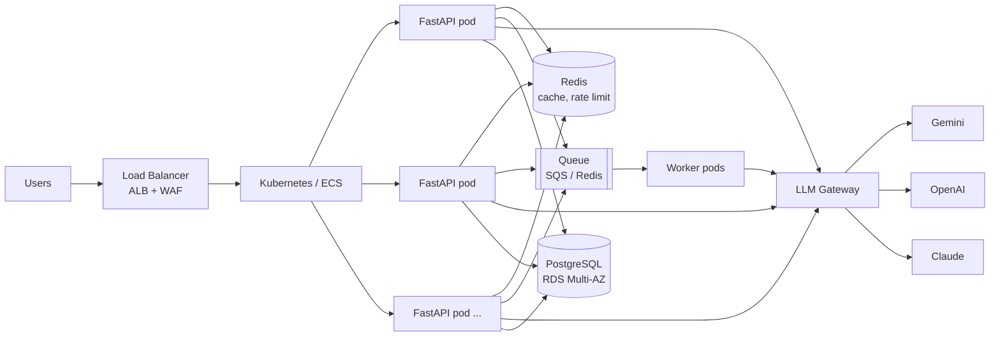

# Architecture & Migration: from one EC2 server to 10,000 users

## The situation

- A Python LLM app runs on **one EC2 server**. It works for ~10 users.
- Expected users: **10,000**.
- It uses an external LLM API and **sometimes gets slow or crashes**.

### Why it is slow and crashes today (likely causes)

| Problem | Why it happens |
|---|---|
| **Single point of failure** | One server: if it crashes or is restarted, everyone is down |
| **Requests pile up** | Each LLM call waits seconds. With few workers, new requests queue behind slow ones and time out |
| **No timeouts** | A hanging LLM call holds a worker forever; enough of them and the app freezes |
| **Hitting LLM rate limits** | Bursts get `429` from the provider and the app has no retry/backoff, so it errors |
| **Memory / disk on the same box** | Database, logs and app share one machine; a full disk or memory spike kills everything |
| **No monitoring** | Nobody knows it's slow until users complain |

The goal is not just "more servers"; it is to remove the single point of failure, protect the LLM limits,
and make failures visible and contained.

## Target architecture

```
                         ┌──────────────── AWS (2+ availability zones) ────────────────┐
Users ─► Route 53 (DNS) ─► Application Load Balancer (HTTPS, health checks, WAF)
                              │
                              ▼
                    Kubernetes (EKS) or ECS ─ FastAPI pods (stateless, HPA 3 → 30)
                       │            │                 │
                       ▼            ▼                 ▼
              ElastiCache Redis   SQS / Redis queue ─► Worker pods (long jobs)
              (cache, rate limit,       │
               token counters)          ▼
                       │          LLM Gateway (LiteLLM or own service):
                       │          rate limits, retries, circuit breaker, fallback
                       │                 │
                       │                 ├─► Gemini
                       │                 ├─► OpenAI
                       │                 └─► Claude
                       ▼
                RDS PostgreSQL (Multi-AZ, backups, read replica)

Secrets Manager · Prometheus + Grafana · CloudWatch / Loki logs · OpenTelemetry traces · CI/CD
```



### Why each component

| Component | Why | Trade-off |
|---|---|---|
| **Load Balancer (ALB)** | One entry point, spreads traffic, removes unhealthy pods, ends HTTPS | Small cost; managed, so little work |
| **Kubernetes (EKS) or ECS** | Runs many copies, restarts crashed ones, rolling deploys, autoscaling | EKS is powerful but complex; **ECS Fargate is simpler** for a small team. I'd pick ECS if the team is small, EKS if there are many services |
| **Stateless FastAPI pods** | Any pod can serve any request, so we can add/remove pods freely | Session data must move to Redis/DB (already done in this project) |
| **Redis (ElastiCache)** | Shared cache, shared rate-limit counters, token usage counters, light queue | Another service to run; managed version handles failover |
| **Queue (SQS or Redis + Celery)** | Absorbs spikes; long jobs don't hold HTTP connections; retry failed jobs | Async results are harder for the client (polling / webhooks) |
| **LLM Gateway** | One place for provider keys, rate limits, retries, fallback, cost tracking | Extra hop (a few ms); could start as a Python module and become a service later |
| **RDS PostgreSQL Multi-AZ** | Automatic backups, failover to a standby, no DB on the app server | Costs more than self-hosting, saves a lot of ops work |
| **Secrets Manager** | Keys and passwords never in code or images; rotation | Small cost |

## How I would handle each concern

### 1. Scaling the application
- Containerise the app (Dockerfile in this repo), make it stateless.
- Run at least **3 pods across 2+ availability zones**, so losing one machine or zone is not an outage.
- **HPA** scales pods on CPU and, better for an I/O-bound LLM app, on in-flight requests or queue length (KEDA).
- Make the LLM call **async** so each pod handles hundreds of waiting requests.
- 10,000 users does not mean 10,000 at once. If 10% are active and each sends one question a minute,
  that's ~17 RPS, which a handful of pods handle easily. Plan for peaks of 5–10×.

### 2. LLM API limits
- Know the limits: **RPM** (requests per minute), **TPM** (tokens per minute), concurrent requests.
- Track usage centrally in Redis (requests and tokens per minute across all pods).
- **Global token bucket** below the provider limit; when near the limit, queue or reject early with a clear `429`
  instead of letting the provider reject.
- Per-user and per-plan quotas so one user can't use everyone's budget.
- **Cache** repeated questions; cap `max_output_tokens`; use a smaller model for simple questions.
- Multiple keys / projects and multiple providers behind the gateway; ask the provider for a higher tier.

### 3. Slow or failing LLM requests
- **Timeout** every call (e.g. 15–20s), never wait forever.
- **Retry** only retryable errors (timeout, 429, 5xx) with **exponential backoff + jitter**, max 2–3 tries,
  and honour `Retry-After`.
- **Fallback chain**: main model → cheaper/faster model → another provider → cached answer or a friendly
  "please try again" message.
- **Circuit breaker**: when a provider's error rate is high, stop sending to it for 30s and use the fallback
  right away. This stops slow failures from tying up every pod.
- **Streaming** responses so the user sees the first words quickly even if the full answer takes time.
- **Bulkheads**: separate worker pools / limits for chat vs heavy jobs, so heavy jobs can't starve chat.

### 4. Where Redis and queues are used

| Use | Tool | Why |
|---|---|---|
| Answer cache | Redis | Same question → instant answer, no tokens |
| Rate limiting (user, tenant, global) | Redis | Counters shared by all pods |
| Token / request counters vs. provider limits | Redis | Global view of LLM usage |
| Circuit breaker state | Redis | All pods agree a provider is down |
| Long or batch jobs (documents, RAG indexing, reports) | SQS or Redis + Celery | Don't block HTTP; retry jobs; smooth spikes |
| Spike buffering | Queue | Accept work at 500 RPS, process at the rate the LLM allows |
| Async chat logging | Queue / background task | Users don't wait for the DB write |

### 5. Retries, timeouts and fallbacks (how they fit together)

```
request ──► timeout 20s ──► fail? ──► wait 1s (+jitter) ──► retry ──► fail? ──► wait 2s ──► retry
                                                                                    │ fail
                                                                                    ▼
                                         circuit open? ──► fallback model / provider ──► fail? ──► cached answer or 503
```

Keep a **total time budget** per request (e.g. 30s) so retries never add up to minutes. Make jobs in the
queue **idempotent** (safe to run twice) because queues can deliver a message more than once.

### 6. Monitoring
- **Metrics** (Prometheus + Grafana): request rate, error rate, p95/p99 latency, LLM latency, LLM errors by
  provider, tokens/min vs limit, cache hit rate, queue length, pod CPU/memory. These are already exposed
  at `/metrics` in this project.
- **Logs**: structured JSON with a request id, central storage (CloudWatch, Loki or ELK).
- **Tracing**: OpenTelemetry to see how much time each request spent in Redis, DB and the LLM.
- **Alerts**: error rate > 5%, p95 > 10s, LLM error spike, tokens > 80% of limit, queue growing, DB CPU high.
- **Cost dashboard** from token counts per user/model (the `chat_logs` table already has this).

### 7. Handling failures

| Failure | Handling |
|---|---|
| Pod crashes | Kubernetes restarts it; the LB sends traffic to the others |
| Node / zone down | Pods spread across zones; the LB routes around |
| LLM provider down | Retries → circuit breaker → fallback provider → friendly 503 |
| Redis down | App continues without cache/rate limit (as in this project); managed Redis fails over |
| Database down | RDS Multi-AZ automatic failover (~1–2 min); `/health` marks pods not ready meanwhile |
| Traffic spike | HPA adds pods, queue absorbs the rest, rate limits protect the LLM |
| Bad deploy | Rolling update with readiness checks; instant rollback to the previous image |

### 8. Migration with minimal downtime

Step by step; each step is small and reversible.

| Step | What | Downtime |
|---|---|---|
| 0. Observe | Add basic metrics and logs to the current server so we have a baseline and can compare | none |
| 1. Quick wins on EC2 | Add timeouts, retries, more Uvicorn workers; put the app behind an ALB (even with one instance) | none / seconds |
| 2. Containerise | Dockerfile, config from env vars, secrets into Secrets Manager; CI builds the image | none |
| 3. Move data out | Create RDS Postgres; copy data with `pg_dump`/restore or AWS DMS (continuous replication); short read-only window to switch over | **a few minutes**, planned at a low-traffic time |
| 4. Add Redis | ElastiCache for cache and rate limiting | none |
| 5. Build the new platform | EKS/ECS cluster with the same image, pointing at RDS and Redis; test with load tests (Locust / k6) at 500 RPS | none (runs alongside) |
| 6. Shift traffic gradually | ALB weighted target groups or Route 53 weighted DNS: **5% → 25% → 50% → 100%** to the new platform while watching dashboards | none |
| 7. Rollback ready | If errors rise, move the weight back to the EC2 server in seconds | none |
| 8. Decommission | Keep EC2 for a week as a fallback, then turn it off | none |

This is a **blue-green / canary** migration: old (blue) and new (green) run side by side and traffic moves
in steps, so there is always a working version and a fast way back.

### 9. Secrets and configuration
- **No secrets in code, Git or Docker images** (this repo follows that: everything comes from env vars).
- **AWS Secrets Manager** (or SSM Parameter Store) for API keys and DB passwords, with rotation.
- In Kubernetes: **External Secrets Operator** syncs them into Kubernetes Secrets; pods read them as env vars.
- Normal settings (model names, timeouts, rate limits) in a **ConfigMap**, different per environment
  (dev / staging / prod).
- **IAM roles** for pods (IRSA) instead of long-lived AWS keys; least privilege.
- Secret scanning in CI so a leaked key is caught before merge.

## Summary of trade-offs

- **Managed services (RDS, ElastiCache, ALB)** cost more but remove most of the work and risk for a small team.
- **ECS vs EKS**: ECS is simpler; EKS is more flexible and portable. Start with what the team can operate.
- **Queues** make the system tougher under spikes but make the client experience asynchronous.
- **Multiple LLM providers** improve reliability, but answers differ slightly between models and each needs testing.
- **Caching** saves cost but may return a slightly stale answer, so use a sensible TTL.
